# Games101视频教程 https://www.bilibili.com/video/BV1X7411F744
## 概述
* 光栅化是指将三维几何图形显示到二维屏幕上
* 几何，如何表示曲线，曲面，通过细分获得更复杂的图形
* 光线追踪, 射出一条光线穿过所有像素点，计算交点和阴影效果,继续反射这些光线，直到光线照射到光源上为止。
* 动画, 模拟物体的运动
* 不教OpenGL,DirectX,Vulcan这些图形API，这门课教的是图形学，而不是图形学API
* 学完这门课后，有能力快速掌握图形学api
* 计算机视觉，涉及理解，猜测图上的内容是什么
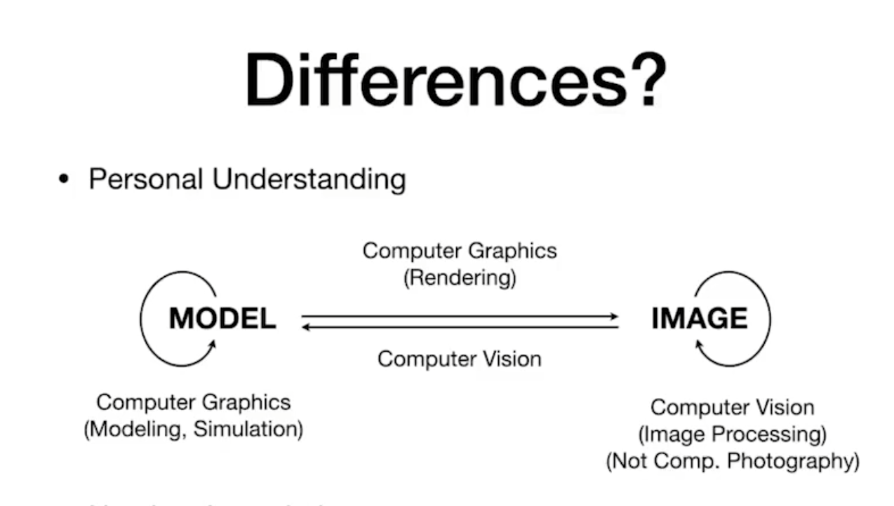
## 线性代数
* 向量,表示方向和长度
* 单位向量,长度为1的向量，希腊字母 上面加^表示
* 图形学默认的向量通常是列向量
* T 符号代表转置
* ||A|| 代表求长度
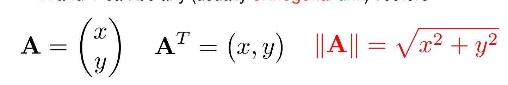
* 点乘,点乘结果是一个数字
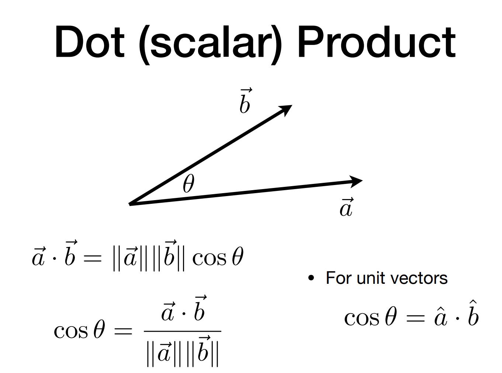
* 点乘计算

* 点乘作用计算夹角的余弦值，进而计算出夹角
* 投影 b向量投影到a向量
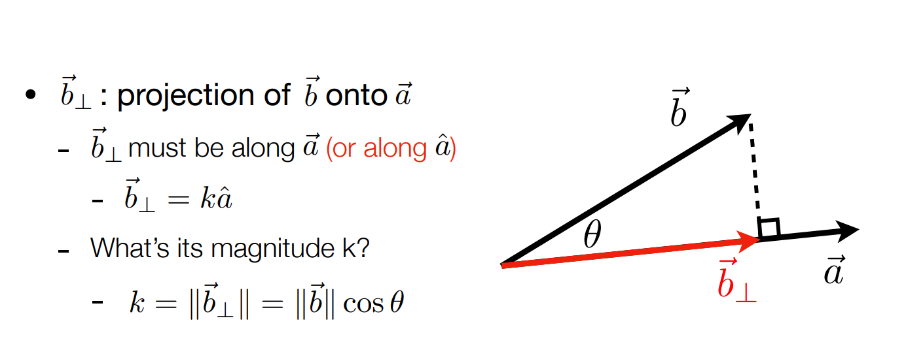
* 计算垂直的向量
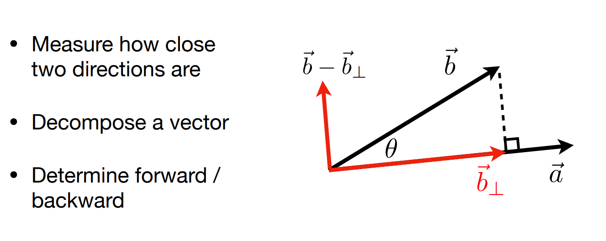
* 点乘可以计算方向前与后的关系,大于0 在前面，小于0在后面
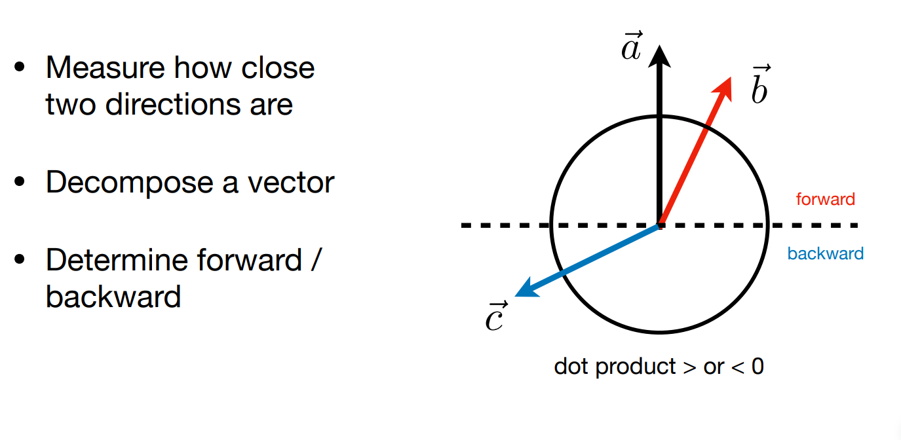
* 点乘值越接近1表示两个向量越接近
* 叉乘 右手螺旋定则，a乘以b那么手掌平摊握拳的方向从a到b，拇指方向就是向量的方向
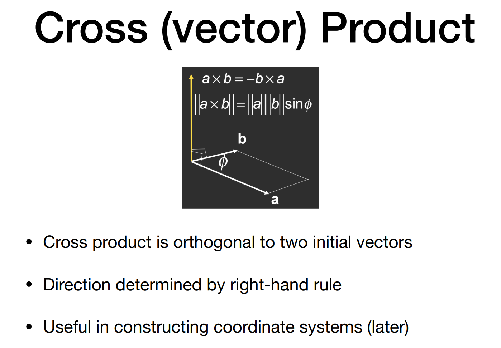
* 如果是左手坐标系，那么方向要用左手螺旋定则判断,这节课默认为右手系
* 叉乘计算
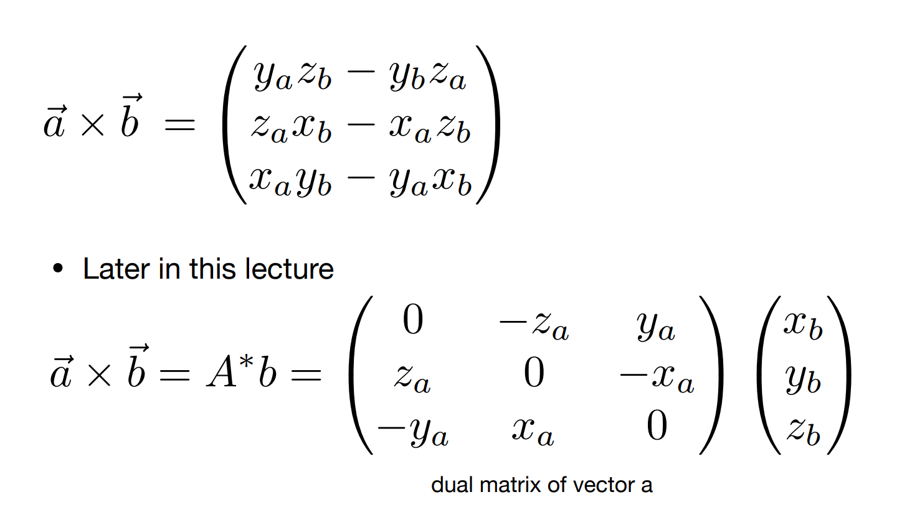
* 叉乘判断左右(顺时针还是逆时针旋转), 将a和b放置到一个平面上，以这个平面建立坐标系，x轴，y轴在这个平面上,如果 a x b 向量和z轴方向相同,那么a旋转到b的方向是逆时针，b向量在a向量的左侧

* 叉乘判断点是否在多边形(凸多边形)内部
AB * AP, BC*BP, CA * CP方向是否一致，一致说明在多边形内部
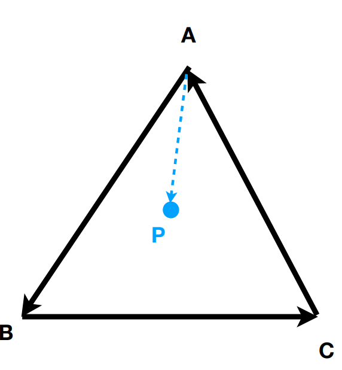
* 向量使用坐标轴上的向量表示
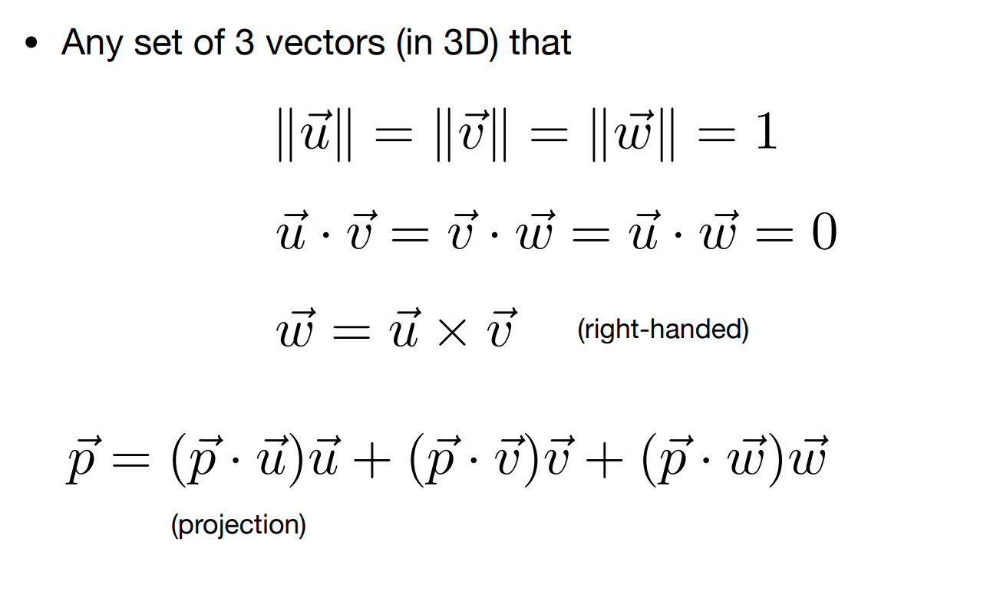
* 矩阵 3行2列矩阵
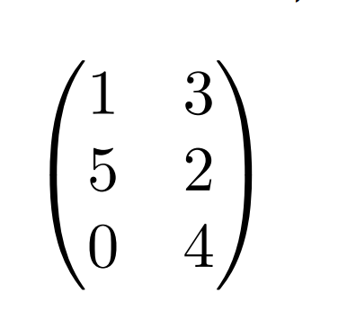
* 矩阵计算 列数和行数相同的矩阵才能乘法, 3行两列 乘以 2行4列得到3行4列的矩阵
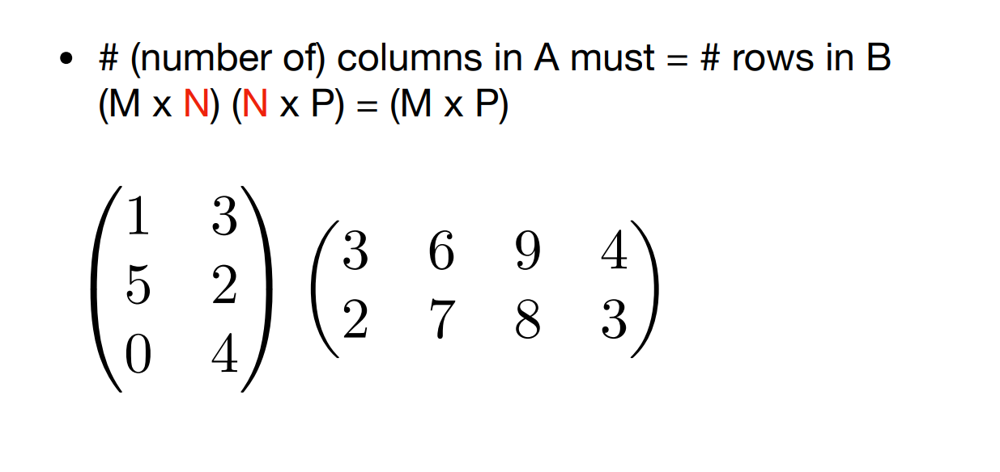
* 矩阵没有交换律 B * A 几乎不等于 A * B ，结合律满足
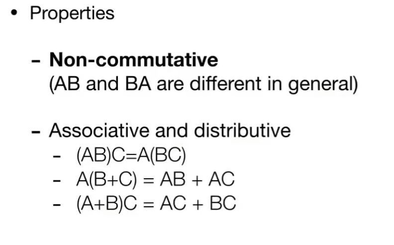
* 矩阵和向量相乘
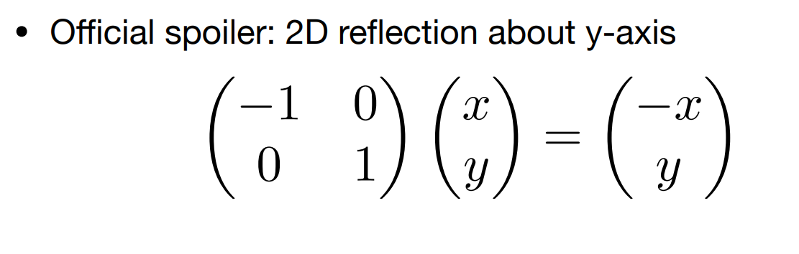
* 矩阵的转置
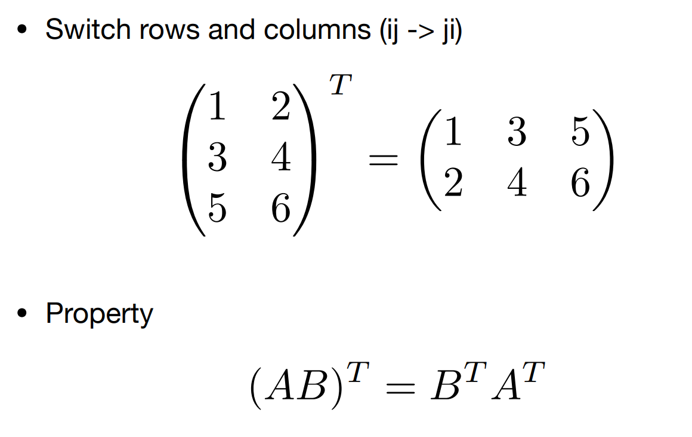
* 单位矩阵,如果矩阵乘以A 等于单元矩阵，则称这个矩阵是A的逆
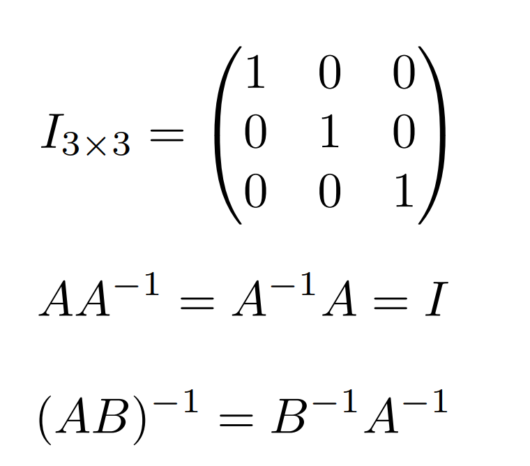
* 常量的乘积可以使用矩阵相乘
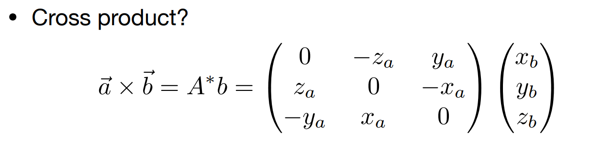
* 
