# Games101视频教程 https://www.bilibili.com/video/BV1X7411F744
## 概述
* 光栅化是指将三维几何图形显示到二维屏幕上
* 几何，如何表示曲线，曲面，通过细分获得更复杂的图形
* 光线追踪, 射出一条光线穿过所有像素点，计算交点和阴影效果,继续反射这些光线，直到光线照射到光源上为止。
* 动画, 模拟物体的运动
* 不教OpenGL,DirectX,Vulcan这些图形API，这门课教的是图形学，而不是图形学API
* 学完这门课后，有能力快速掌握图形学api
* 计算机视觉，涉及理解，猜测图上的内容是什么

## 线性代数
* 向量,表示方向和长度
* 单位向量,长度为1的向量，希腊字母 上面加^表示
* 图形学默认的向量通常是列向量
* T 符号代表转置
* ||A|| 代表求长度

* 点乘,点乘结果是一个数字

* 点乘计算

* 点乘作用计算夹角的余弦值，进而计算出夹角
* 投影 b向量投影到a向量

* 计算垂直的向量

* 点乘可以计算方向前与后的关系,大于0 在前面，小于0在后面

* 点乘值越接近1表示两个向量越接近
* 叉乘 右手螺旋定则，a乘以b那么手掌平摊握拳的方向从a到b，拇指方向就是向量的方向

* 如果是左手坐标系，那么方向要用左手螺旋定则判断,这节课默认为右手系
* 叉乘计算

* 叉乘判断左右(顺时针还是逆时针旋转), 将a和b放置到一个平面上，以这个平面建立坐标系，x轴，y轴在这个平面上,如果 a x b 向量和z轴方向相同,那么a旋转到b的方向是逆时针，b向量在a向量的左侧

* 叉乘判断点是否在多边形(凸多边形)内部
AB * AP, BC*BP, CA * CP方向是否一致，一致说明在多边形内部

* 向量使用坐标轴上的向量表示

* 矩阵 3行2列矩阵

* 矩阵计算 列数和行数相同的矩阵才能乘法, 3行两列 乘以 2行4列得到3行4列的矩阵

* 矩阵没有交换律 B * A 几乎不等于 A * B ，结合律满足

* 矩阵和向量相乘

* 矩阵的转置

* 单位矩阵,如果矩阵乘以A 等于单元矩阵，则称这个矩阵是A的逆

* 常量的乘积可以使用矩阵相乘

## 变换
* modeling(模型变换),Viewing(视图变换)
* Modeling
    * translation 移动
    * rotation 旋转
    * scaling 缩放
* Viewling: 3D to 2D projection(投影)
* 缩放矩阵(scale Matrix)
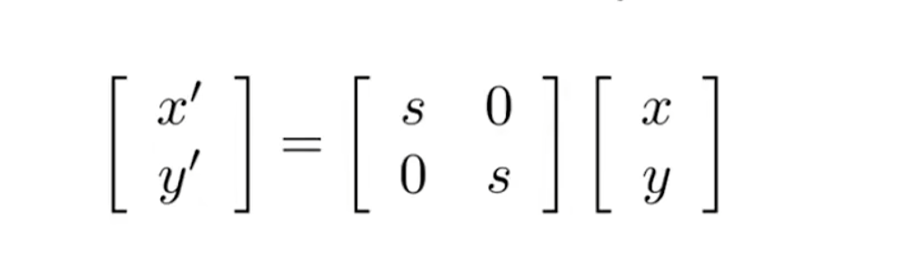
* 切变(Shear Matrix)

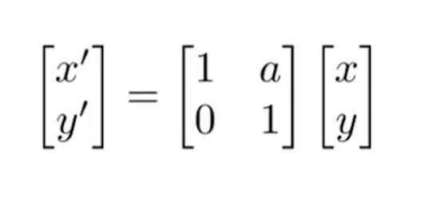
* 三角函数 和差公式

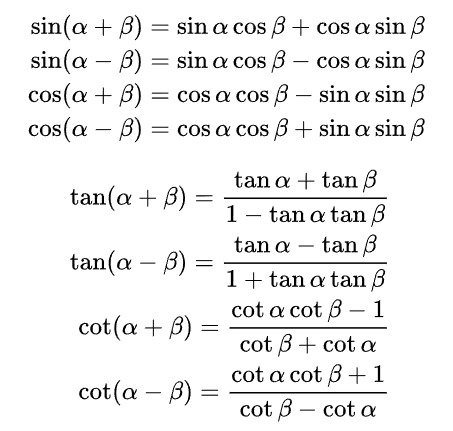
* 旋转矩阵(默认绕原点逆时针旋转)
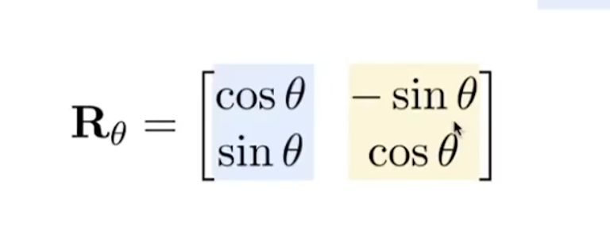
* 线性变换都能使用矩阵来表示
* 平移变换 无法使用矩阵乘法来表示

* 齐次坐标
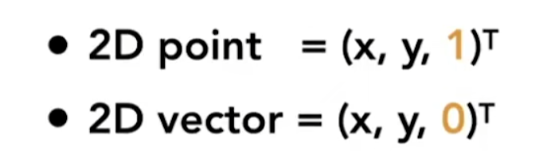
向量最后一位为0可以保证向量平移之后方向不变
* 齐次坐标表示平移
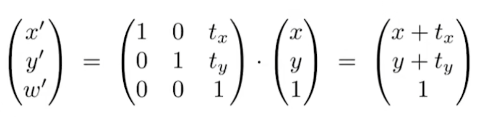
* 齐次坐标，相加减少的意义
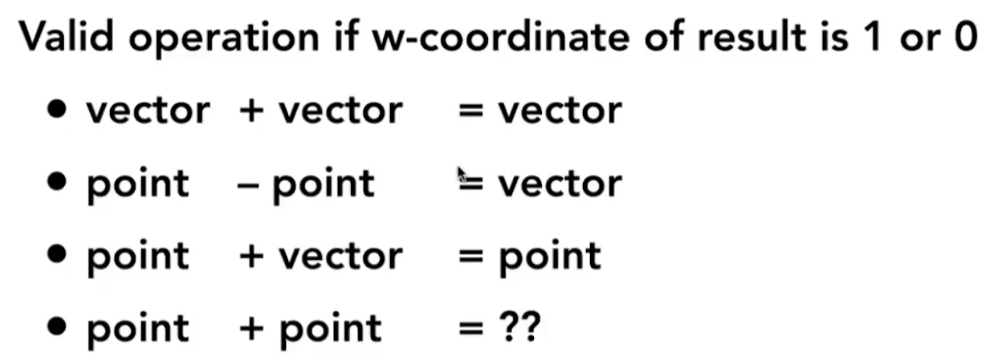
* 最后一位不为1的点表示如下,额外定义
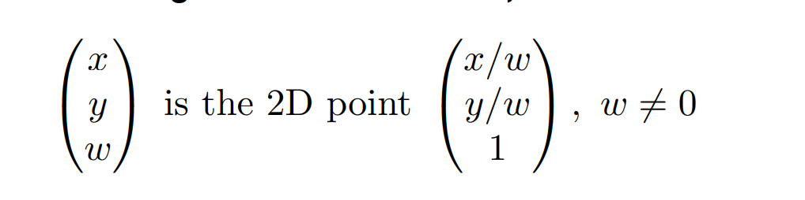
点+点表示两个点的中点
* 逆变换,乘以矩阵的逆可以变换为变换前的状态
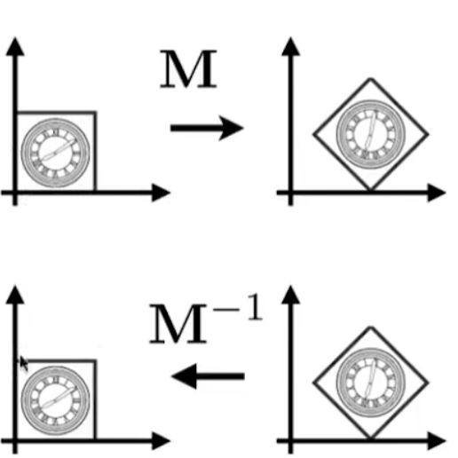
* 变换的组合
    + 变换的顺序影响结果，矩阵的乘法不满足交换律
    + 矩阵满足结合律，ABC = A(BC),所以可以将An乘以到A1计算得到一个矩阵作为最终的变换矩阵
    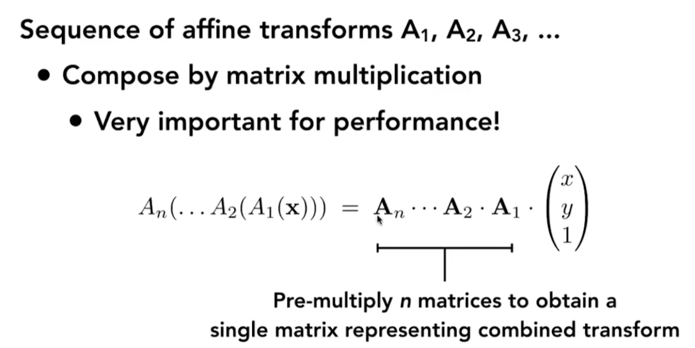
    * 让图形以任意一个点旋转，那么可以将图形先移动到原点，然后旋转后，再平移回去
* 仿射变换 = 线性变换 + 一个平移变换
* 三维变换 

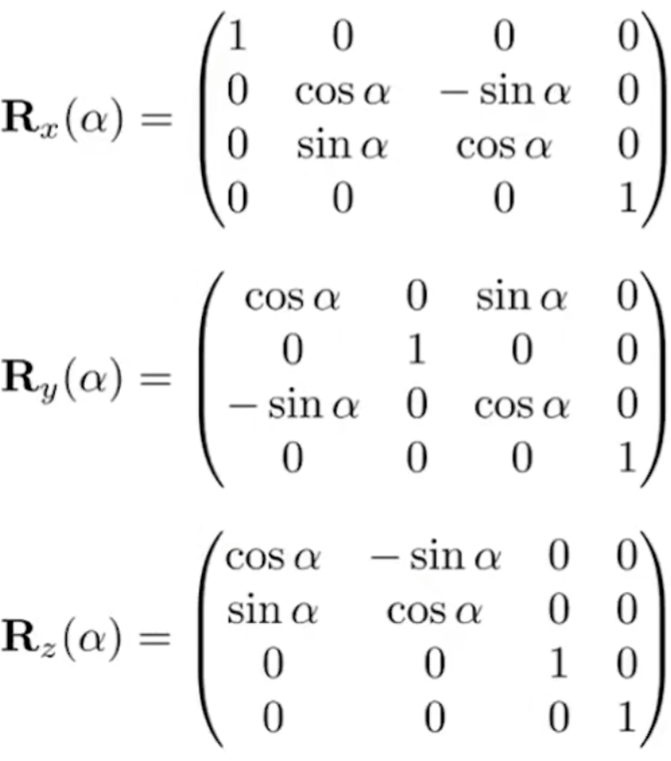
* 欧拉角
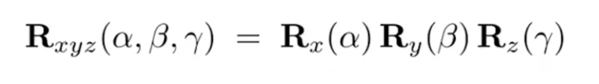
* 旋转矩阵的转置 = 这个旋转矩阵的逆,数学上称这种矩阵为正交矩阵
* View/Camera Transformation(视图/相机变换)
* 通常将camera放置在原点，并且上方向为y轴正方向，看着 -z的方向
    * g指的是朝向也比如-z方向，t表示上方向比如y轴正方向。
    + 任意点的摄像机，将摄像机平移到原点
    * 再旋转g到-z，t 到y,(g x t)到x轴，就可以变换到约定俗成的位置上，这个旋转不好求
    * 所以考虑求将X to (g x t),y to z,z to -g的矩阵
    * 因为旋转矩阵的逆就是他的转置，这样就能得到结果矩阵
    * 变换摄像机时，同样也要变换其他图形，这样摄像机和图形没有相对运动，拍摄的图形是一样的
* 投影,正交投影，透视投影
    + 正交投影不会带来近大远小
    + 人眼更类似透视投影
* 正交投影
    * 将摄相机 放到原点，看向-z 向上方向为y
    * 丢弃z坐标
    * 变换和缩放方形都拉成x和y都在 [-1,1]的范围上就是正交投影
    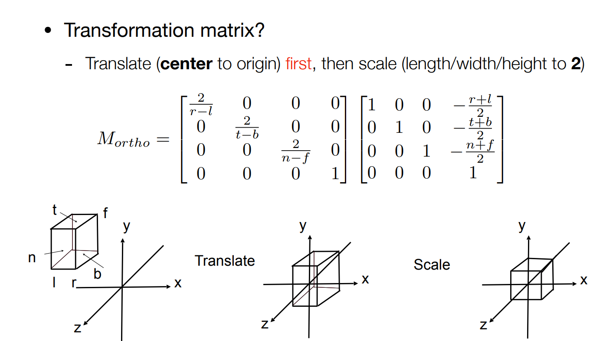
* 透视投影
    + 齐次坐标中(x,y,z,1) 和(kx,ky,kz,k(k!=0))表示的是同一个点
    + 近平面为n，远平面为f(因为是从-z方向看，n坐标大于f坐标)
    + 透视->正交变换矩阵
    + 可以理解成将远平面挤成和近平面坐标相同，并且近平面和远平面的z轴不变,中心点不变
    + 对于所有的点有以下关系
    + 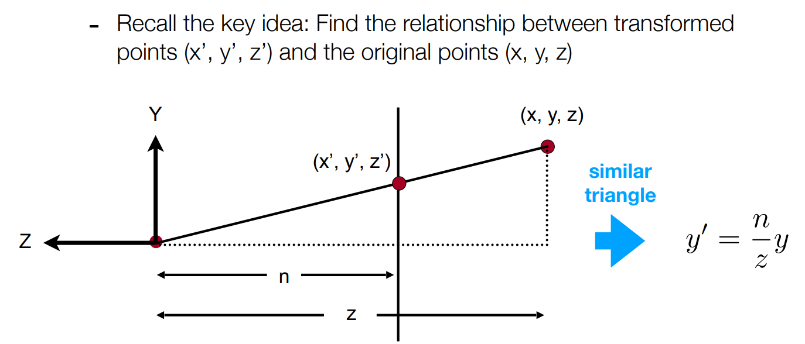
    + 所以变换是和z相关，因为是齐次坐标可以乘以z来进行简化
    + 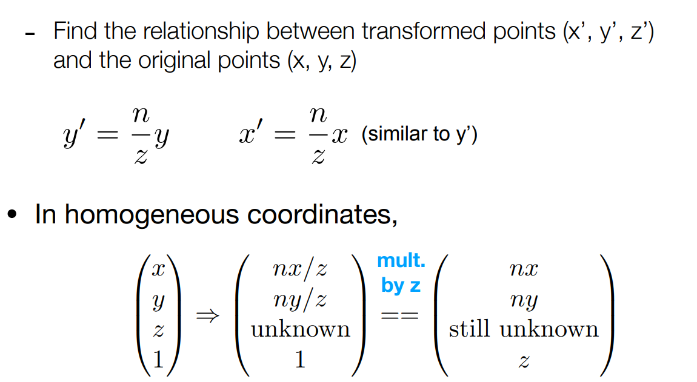
    + 要得到结果,所以矩阵的第一行，第二行，第四行是能确定的
    + 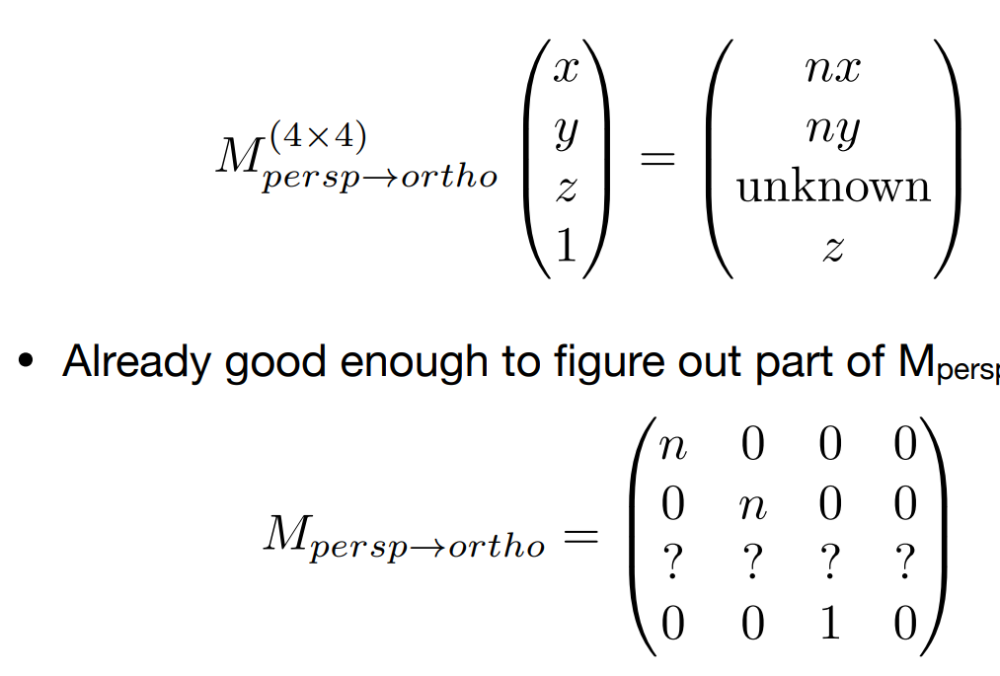
    + 在近平面和远平面的z都不变, 图形的中点的(x,y,n,1)和(x,y,f,1)变换后的值应该为(nx,ny,n^2,n),(fx,fy,f^2,f)(上面说明虽然表示的点是同一个，但是要都乘以z坐标的值)，这样可以列方程求解,因为坐标的变换规律肯定和x，y坐标无关所以
    + 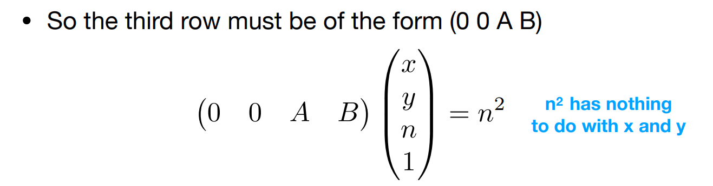
    + 方程为
    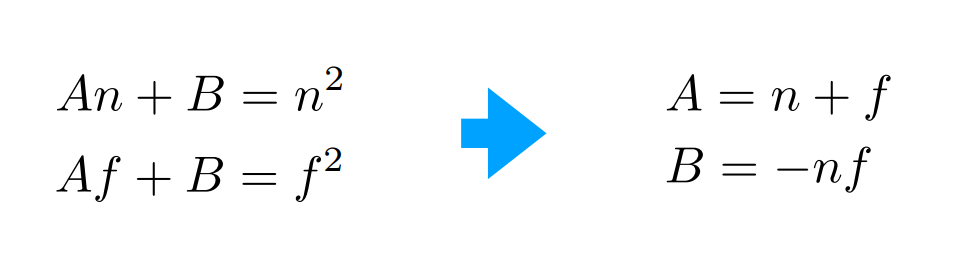
    + 最后再做一次正交投影就能得到透视投影的变换矩阵
    + 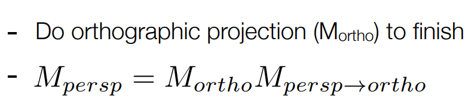
## 光栅化
* 如何定义一个近平面
    * 宽除以高，aspect ratio 长宽比
    * 视角，能看到的角度范围,垂直的可视角度
    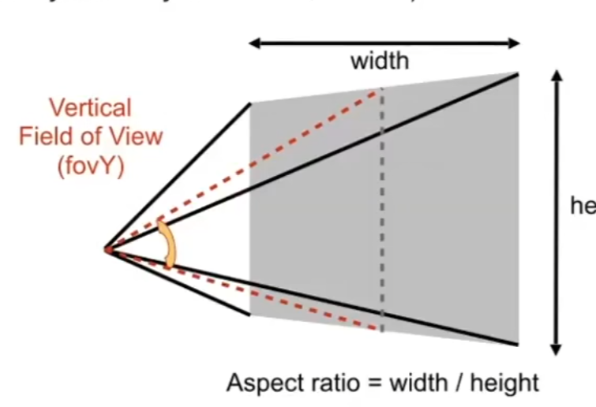
* 光栅化，将三维物体画在屏幕上
*  屏幕坐标系,约定x,y为整数，坐标原点在左下角
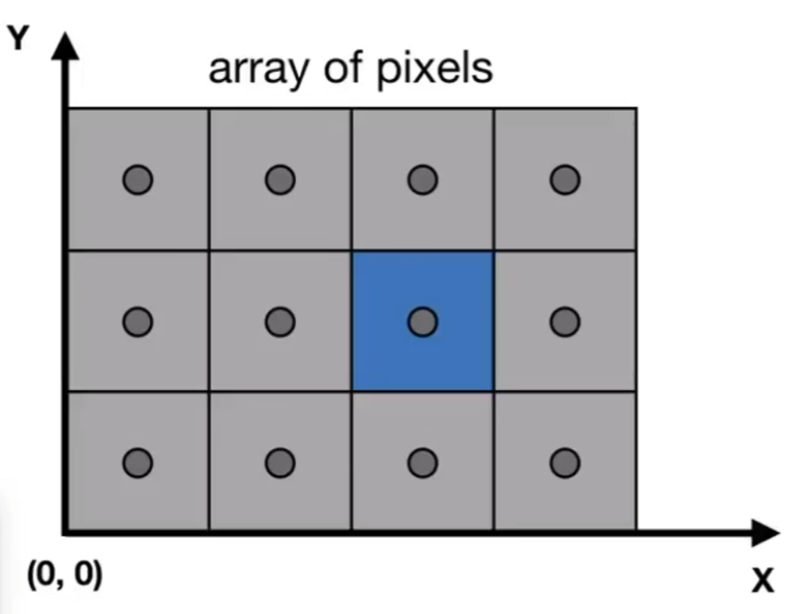
* 像素的中间是在(x+0.5,y+0.5)
* 投影完的坐标是[-1,1] 将其转化到[0,width] * [0,height]的空间上，视口变换,下一步将三维的三角面片转为像素
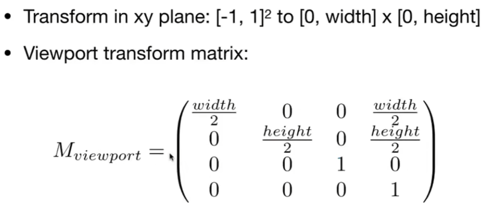
* 光栅化过程中，三角形线段经过了像素的一部分怎么判断像素的颜色，采样，获取像素中心所属的三角面片
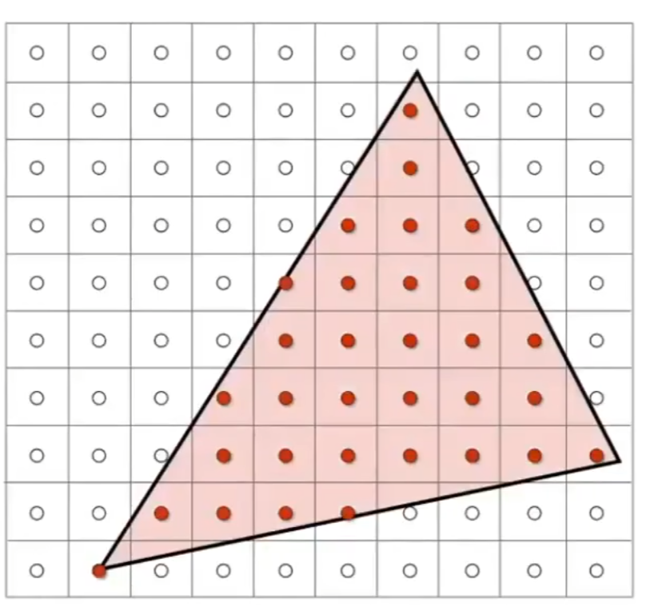
* 判断像素中心是否在三角形里面
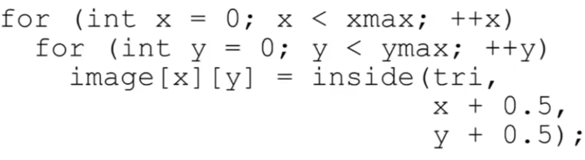
* 包围盒，不需要从0遍历到max x，0到max y，可以使用三角形的包围盒也就是最小和最大x,y覆盖的范围,还有更好的算法
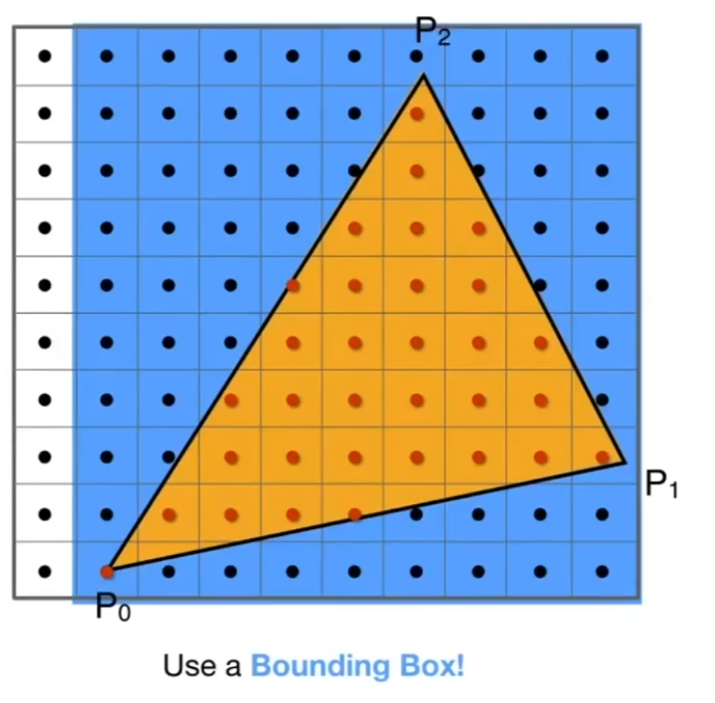
* 更好的遍历算法
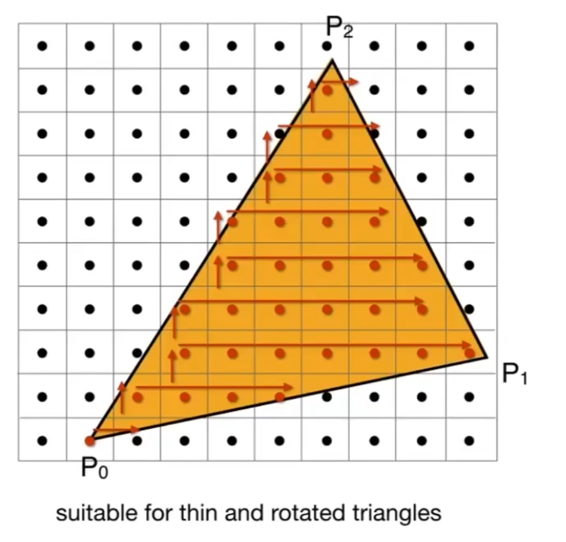
* 这样采样后，三角形有走样，有锯齿
* 反走样 
* Pre-Filter 做一个模糊(滤波)操作 再做采样 可以反走样
* 先采样再模糊，不行
    * 估计是原本的图形的 是连续的，采样后变成了离散的点再做采样的化因为丢失的信息过多模糊的边界不够大，而先做模糊再采样，模糊的范围够大效果更好
* 滤波，避免某些特定的频率，去掉这些
* 频谱？
* 高通滤波(Hight-pass filter)，只有变化高频的地方保留,保留高频的信息，比如图像的边界
* 低通滤波(Lowpass filter),保留变化低的地方
* 卷积 图形学简化的定义
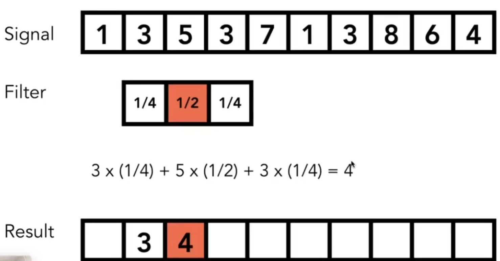
* 反走样方法，增加采样率(提高像素)
* 每个像素点计算三角形的覆盖范围 计算覆盖面积除以像素的面积，计算量大
* MSAA，将一个像素点分成4*4个小的假的像素点，对这些进行采样，显示的时候再进行合并,这是一个近似算法。
* FXAA Fast Approximate AA
* TAA Temporal AA
* Super resolution 超分辨率 拉大一张图片，不想看到锯齿 Super sampling 
* DLSS 使用深度学习
* 画家算法,从后往前画，先画后面的再画前面的，覆盖掉之前的画的
    + 需要从远到近排序三角形
    + 交叠的三角形无法处理
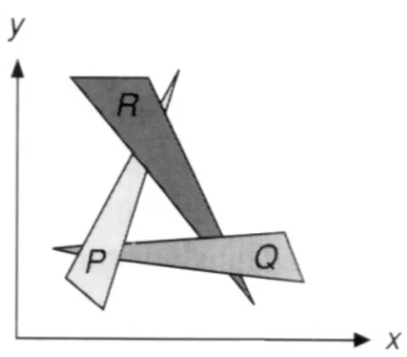
* z buffer（深度缓冲）
    + 采样的三角形面片，可能会映射到同一个像素点
    + 对于每个采样出来的像素保存一个最近的深度（通常是z，并且是整数所以是最小的z）
    * 同时要保存最近的像素对应的颜色，这个是framebuffer表示每个像素的颜色。也是最后要在屏幕上显示的颜色。

## 着色(shading)
* Blinn-Phong Reflection Model，一个着色模型
    + 高光（镜面反射）
    + 漫反射 Diffuse light
    + 间接光照,环境光照 Ambient lighting
* 在一个特定的shading point 计算光线反射
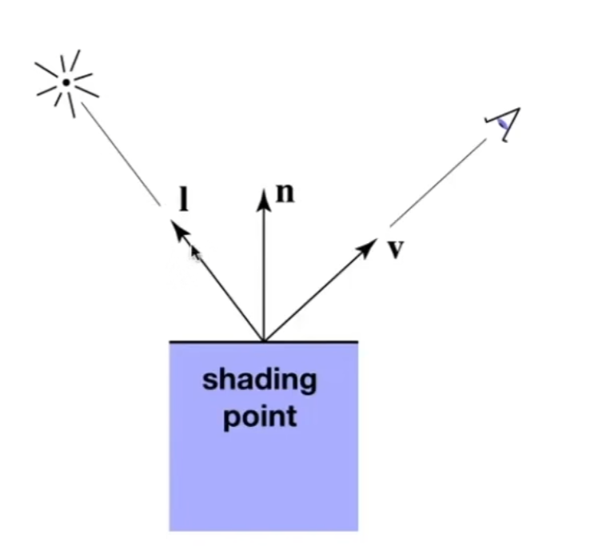
* Shading is Local,只考虑这个点的情况,现在不考虑阴影的情况
* 同样的光照以不同的角度射到同一个物体上颜色不一样
* 点光源的亮度衰减，和距离的平方成反比
    + 光线是向四周发散的，可以近似为一个球，球的表面积公式为4*PI*r^2
    + 总能量是固定的，所以越往外发散，能量越小，每个点的能量会根据距离的平方来衰减。

* Lambertian (Diffuse)Shading 漫反射往四周反射应该是一样的，所以和视线方向无关
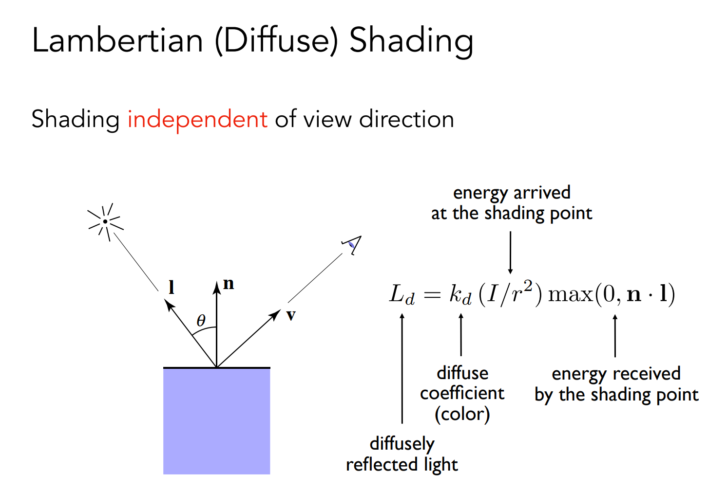
* 高光，观察方向和镜面反射方向接近时能看见
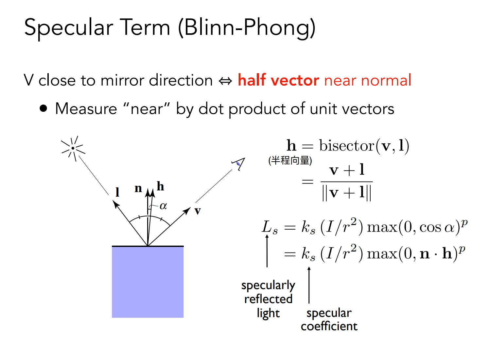
 + p表示余弦的指数，用于控制高光的范围，越大范围越小
* 环境光照,假设所有环境光亮度都是一样的
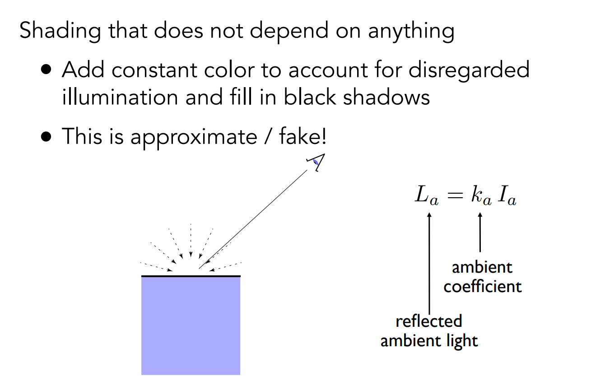
* 全部加起来就是Blinn-Phong Reflectance Model
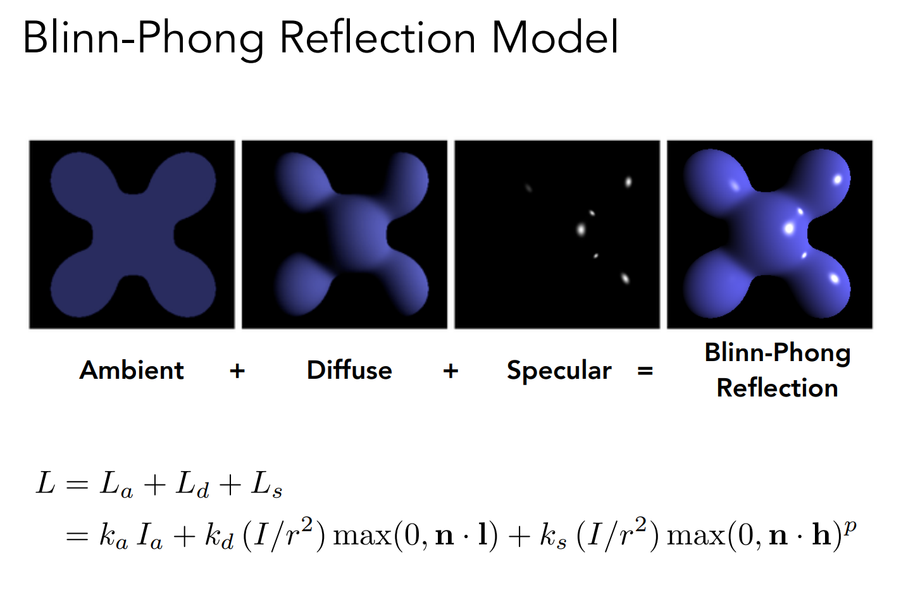
* 着色频率(Shading Frequencies)
* flat shading，只对三角形面片做一次着色计算，这个三角形面片上所有颜色都相同
* Gouraud shading，对每个三角形面片的顶点做一次着色计算，三角形内部通过插值来计算
* Phong shading， 对每个像素计算一个着色
* 当三角形面片很多时模型很复杂时，falt shding效果并不一定比Gouraud shading好
* 顶点的法线，如果知道表示的图形是什么，可以根据几何关系来计算，比如球
* 通过的做法是相邻的面的法线求平均，可以根据面的大小求加权平均
* 用到重心坐标来计算三角形内部的法线方向
* Graphic (Real-time Rendering) Pipeling （实时）渲染管线 表示一系列不同的操作

* 顶点着色器（在顶点上着色，比如groud shading）
* fragment（像素/片段）着色器，在像素上着色
* 写着色器的网站https://www.shadertoy.com/view/lffSRN
* 如何定义不同物体的不同点的漫发射系数，如何定义点的不通过数据
    + 3d图形的表面是2D的图片(texture)，这个图片的点和表面对应，并且保存了一些数据
* tileab Texture,无缝Texture，可以无缝复制拼接。
* Texture mapping 纹理/贴图
* 
