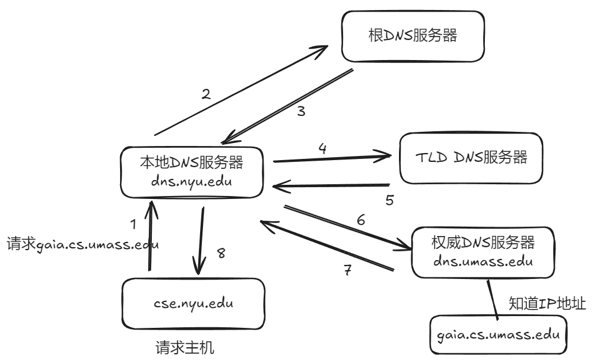
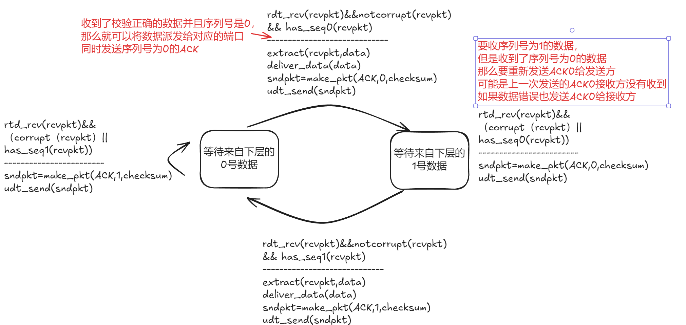
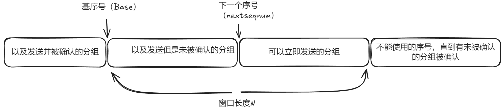

## 计算机网路和因特网
* 连入网络中的设备比如手机，电脑等称为端系统或主机
* 端系统通过通信链路和分组交换机连接在一起，常见的类型是路由器（router）和链路层交换机器（link-layer switch）
* 端系统通过因特网服务器提供商（ISP）接入因特网
* 端系统，分组交换机和其他因特网部件都要运行多个协议，这些协议的标准由因特网工程任务组（IETF）研发
* 端系统提供了一个套接字接口，该接口规定了端系统和其他端系统发送和接收的方式
* 接入网是指将端系统物理连接到边缘路由器的网络，边缘路由器是端系统到任何其他远程端系统路径上的第一台路由器
* 光纤到户（FTTH）从ISP到家庭的光纤路径，有两种光纤网络有源光纤网络（AON）和无源光纤网络（PON），AON本质上是交换以太网
* 数据是在每个传输器和接收器之间通过传播电磁炮活光脉冲的方式跨越物理媒介（physical medium）进行发送
* 在网络应用中端系统彼此交换报文，报文保包含该应用设计者需要的任何东西。
* 为了从源端系统到目的端系统发送一个报文，源会将长报文划分为较小的数据块，称为分组。每个分组通过通信链路和分组交换机传送
* 传送速率用bps(比特/s)来表示
* 通过网络链路和交换机移动数据有两种基本方法：电路交换和分组交换
* 分组交换
    * 定义
    
    * 转发表和路由选择协议
    
    * 分组交换的时延包括节点处理时延，排队时延，传输时延和传播时延。
    * 传输时延类似工人将产品丢到传送带的耗时，传播时延类似传送带把产品从一端送到另一端的时间。
* 电路交换
    * 定义

    * 频分复用（FDM）和 时分复用（TDM）
    
* traceroute程序可以跟踪可以追踪分组数据经过的路由器，windows下的命令是tracert
* 网络分层协议，各层的所有协议称为协议栈，因特网的协议栈由物理层，链路层，网络层，运输层，应用层组成。(物理层为第一层)


* 链路层交换机实现了第一层和第二层，路由器实现了第一层到第三层
* 一个大报文可能被划分为多个运输层报文段，每个报文段又可能被划分为多个网络数据报
* DoS拒绝服务攻击，DDoS分布式拒绝服务攻击
## 应用层
* 应用体系结构固定了各种端系统上如何组织该应用程序，有两种主流的体系结构：客户端-服务器体系结构和对等（P2P）体系结构
* 在一对进程之间的通信会话中发起通信的进程标识为客户，在会话开始时等待联系的进程是服务器
* 套接字是同一台主机内应用层和运输层之间的接口，可以选择运输层协议以及少量运输层参数
* 进程寻址，为了发送分组，接受进程需要有一个地址
    * 主机的地址，由IP地址标识
    * 在目的地指定接受进程的标志符，使用目的地的端口号来标识
* 如何确定要使用怎么样的运输层协议，可以对应用服务要求进行分类：可靠数据传输，吞吐量，定时(指的是时延，书中这么写很奇怪)和安全性。
* 如果一个协议确保了由应用程序发送的数据正确并完全地交付给另外一端，就认为这个协议提供了可靠数据传输（reliable data transfer）
* TCP服务包含面向连接服务器和可靠数据传输服务
    * 在应用层报文开始流动之前TCP让客户端和服务器互相交换了运输层控制信息，之后便建立了一个TCP连接，该连接双方都可以收发报文
    * TCP可以无差错，按正确的顺序交付所有发送的数据
* TCP拥有拥塞控制机制，当发送方和接收方之间的网络出现拥塞时，TCP的拥塞机制会抑制进程发送数据。
* TCP和UDP都没有提供加密措辞，有一种加强型的TCP，称为运输层安全（Transport Layer Security,TLS）提供了进程到进程的安全性服务包含加密，数据完整性和端点鉴别。但是TLS不是运输层协议而是应用层上实现的。
* UDP服务仅提供最低限度的服务，无连接，没有握手过程，不可靠数据传输，当进程使用UDP发送报文时，UDP并不保证改报文将到达接受进程。
* 运输层协议没有对定时（时延）和吞吐量进行保证的服务。
* 应用层协议通常定义了以下内容：
    * 交换的报文类型，例如请求报文和相应报文。
    * 各种报文类型的语法，如报文中有哪些字段，以及这些字段如果描述。
    * 字段的语义，即这些字段的信息的含义。
    * 确定一个进程何时以及如何发送报文，以及对报文进行相应的规则。
* Web的应用层协议是超文本传输协议（HyperText Transfer Protocol,HTTP）
* Web页面由对象组成，一个对象时一个文件，可以是一个HTML文件，一个JPEG图形，一个JavaScript文件，一个CCS样式表文件。
* URL由两个部分组成：存放对象的服务器主机名和对象的路径名
    * 例如URL http://www.someSchool.edu/someDepartment/picture.gif. 其中www.someSchool.edu就是主机名，/someDepartment/picture.gi是路径名
* 服务器向客户端发送被请求的文件，而不存储任何改客户端的状态信息，说明HTTP协议是一种无状态协议。
* 客户和服务器会在相当长的时间范围内通信，此时应用程序的研制者需要做出一个重要选择是采用非持续连接还是持续连接。
    * 非持续连接，每个请求/响应对是经一个单独的TCP连接发送。
    * 持续连接，所有请求及其相应经相同的TCP连接发送。
* 往返时间（Round-Trip Time，RTT），改时间是指一个短分组从客户到服务器然后再返回客户所花费的时间。
### HTTP协议
* HTTP报文格式，HTTP规范（RFC 1945; RFC 7230; RFC 7540）包含了对HTTP报文格式的定义，HTTP报文有两种： 请求报文和响应报文。
* HTTP请求报文
    
报文第一行叫做请求行（request line），后继的行叫做首部行（header line，其通用格式是
    
    sp是空格，cr是回车 lf是换行，当是使用POST方法时才会使用实体体，其中包含的就是表单字段的输入值
* 方法字段包含GET、POST、HEAD、PUT和DELETE。
* 用表单生成的请求不是必须使用POST方法，也可以将输入放到URL字段中，比如www.somesite.com/animalsearch?monkey=123&bannas=123其中monkey和bannas就是输入值。
* HEAD方法类似GET方法，当服务器收到HEAD方法的请求时将会用一个HTTP报文进行相应，但是不返回请求对象。
* PUT方法允许用户上传对象到Web服务器上指定的路径。
* DELETE方法允许用户删除Web服务器上的对象。
* HTTP响应报文

    
    通用格式是
    
    + 状态码
        - 200 OK 请求成功
        - 400 Bad Request，通用差错代码，服务器不理解改请求
        - 404 Not Found
        - 505 HTTP Version NotSupported http版本不支持】
        - 304 Not Modified
* cookie 
    + 会在HTTP响应报文中添加一个Set-cookie首部行如 Set-cookie: a=1234;b=456
    + HTTP请求报文中会使用Cookie首部行
    + 浏览器会保留一个cookie文件，文件中会包含主机名和cookie名称和值
    + Web服务器会维护后端数据库
* Web缓存器（也叫代理服务器） 缓存http请求的网络实体，提供给浏览器。
    + 作为缓存服务器需要保证自己的缓存是新的，没有过期，HTTP通过使用条件GET的方式来判断缓存是否被修改了。
    
* 使用内容分发网络（Content Distribution NetWork，CDN）
* 经过单一TCP连接发送一个Web页面中的所有对象存在队首阻塞
    
* HTTP/2的主要目标是减小感知时延。
* HTTP/2,将每个发送的报文分成小帧，并在相同的TCP连接上交错发送请求和响应报文。

* HTTP/2成帧子层也可以进行二进制编码，二进制协议解析跟为高效可以得到略小的帧。
* HTTP/2成帧子层可以根据要求安排请求的相对优先权，每个报文会分配1到256之间的权重，较大的数字代表较高的优先权。
* 另一个特征是运行服务器为一个客户请求发送多个响应，因为对HTML网页的请求指示了需要在网页上显示的全部对象，服务器可以预先把需要的数据发送给浏览器。
* HTTP/3，QUIC是一种新型的协议，它应用层的UDP之上运行。
### SMTP 电子邮件
省略
### DNS 因特网的目录服务器
* 使用主机名（hostname）如www.baidum.com标识主机没有因特网的位置信息。使用IP进行标识不便于记忆。需要一个主机名到IP地址转换的目录服务。
* 域名系统（Domain Name System，DNS）是有一个分层的DNS服务器实现的分布式数据库，一个是得主机能够查询分布式数据的应用层协议。
* DNS服务通常是运行BIND（Berkeley Internet Name Domain）软件的UNIX机器，DNS协议运行在UDP之上，使用53号端口。
* 复杂主机能拥有一个或者多个主机别名，完整的命名称为规范命名。
* DNS服务器也能用于负载均衡，一个规范主机名可以对应多个IP地址，在访问时会循环这些IP地址。
* 一台用户主机上会运行这DNS应用的客户端，浏览器会将主机名传给该客户端让它向DNS服务器发送查询请求。
* 根DNS服务器: 提供TLD服务器的IP地址
* 顶级域服务器(TLD服务器):通常是地址最后一个点之后的字符是顶级域，例如com,org,net,edu。提供权威DNS服务的地址
* 权威DNS服务器:通常是一个组织结构提供访问自己主机的DNS记录,或者一个组织结构将这些记录保持到另一个服务器提供商的权威服务器当中。
* 本地DNS服务器结构，严格来说这个不属于DNS层次结构，他通常是ISp提供的。


* IP地址查询过程

* 请求主机向本地DNS发起查询，本地DNS返回给了请求主机最终值，这个过程称为递归查询,而本地DNS分别想根DNS服务器，TLD NDS服务器，权威DNS服务器发起查询最后才得到IP地址这个过程称为迭代查询
* 任何DNS查询都可能是迭代的也可能是递归的。
* DNS缓存为了提高查询效率，DNS服务器当收到一个DNS回答时，会将结果保存到本地，DNS服务器在一段时间后将丢弃缓存的信息。
* DNS服务器中保存了资源记录（Resource Record,RR），资源记录提供主机名到IP地址的映射
* DNS 记录格式是以下字段的四元组
    + (Name, Value, Type, TTL)
    + TTL是改记录的生存时间，决定记录上面时候从缓存中删除。
    + Type=A时，Name是主机名，Value是该主机名对应的IP地址
    + Type=NS时，Name是个域（如foo.com），Value是知道如何获得该域中主机IP地址的权威DNS服务器的主机名字,通常还会有该权威DNS服务器的Type A类型的一条记录
    + Type=CNAME时，Value时别名为Name的规范主机名
    + Type=MX时，则Value时名为Name的邮件服务器的规范主机名,通过使用MX记录，邮件服务器和其他服务器可以有相同的别名。
* DNS报文格式

    + 使用nslookup命令可以发送查询报文

* 如何在DNS数据库插入数据
    + 需要找到注册登记机构
    + 提供你的基本和辅助权威DNS服务器的名字和IP地址
    + 该登记机构确保将一个类型NS和一个类型A的记录输入对应的TLD NDS服务器
    + 必须确保用于web服务器的www.开头的类型A资源记录和用于邮件服务器的mail开头的类型MX资源记录被输入你的权威DNS服务器中。
    + 在RFC 2136和 RFC 3007中有定义的DNS的动态更新

## 运输层
* 运输层协议为运行在不同主机上的应用进程之间提供了逻辑通信,通过逻辑通信不同进程的主机好像直接相连一样。
* 运输层协议是运行在端系统当中的而不是在路由器中实现的。
* 网络层有一个IP即网际协议，IP的服务器模型是尽力而为交付服务，不保证报文段的交付，不保证报文段的按序交付，不保证报文段中数据完整性。所以IP被称为不可靠服务(unreliable service)。
* UDP和TCP最基本的责令是将两个端系统间IP的交付服务器扩展为运行在端系统上的两个进程之间的交付服务,这个被称为运输层的多路复用(transport-layer multiplexing)和多路分解(demultiplexing)。
* 多路复用:在源主机从不同的套接字中收集数据块,并为每个数据块封装到首部信息从而生成报文端，然后将报文段传递给网络层，这些工作称为多路复用。
* 多路分解:将运输层报文段中的数据交付到正确的套接字的工作称为多路分解。
* 运输层多路复用要求： 套接字有位移标识符，每个报文段有特殊字段指示报文段要交付的套接字。这些字段是源端口号字段和目的地端口号字段。
* UDP的多路复用和多路分解,UDP套接字是是由一个二元组全面标识的，该二元组包含目的IP地址和目的端口号。如果两个UDP报文段有不同的源IP地址或源端口号，但是有相同的目的IP地址和目的端口号，那么这两个报文段将通过相同的目的套接字被定向到相同的目的进程。
* UDP 无需建立连接延时更低，关于什么时候发送数据，发送什么数据应用层可以控制的更精细，可以使用在需要延时很低并且可以容忍一些数据丢失的应用上。分组首部开销小。
* UDP协议格式

* 自动重传协议（Automatic Repeat reQuest,ARQ），接受方使用确认（ACK），否认（NAK）这些控制报文让发送方知道哪些内容被正确接受，哪些内容有误并要求重传的机制。需要三种协议功能：差错检验 ，接收方反馈和重传。
* 发送方发送一个分组数据后等待接受方的ACK或者NAK时发送方应用层不能再发送数据的ARQ协议叫做停等协议。
* 为了让接受方知道分组是重传的还是新的分组，所以分组需要一个序号来进行识别。
* 停等协议发送方

* 停等协议接收方

* 上图的序列号只在0和1之间交替，因此这种协议也被称为比特交替协议。
* 发送方至少需要等待一个这样长的时间：发送方和接收方之间的一个往返延时，来确认ACK没有收到时将数据重传。
* 停等协议由于发送方大量时间都在等待ACK，发送速率很低。有一种解决方式就是发送方不已停等的方式运行，允许发送方发送多个分组而无需等待确认，发送数据类似填充一条流水线，这种技术又称为流水线技术，这种协议称为流水线可靠数据传输协议。
    + 需要增加序号范围。
    + 协议的发送方和接收方两端不得不缓存多个分组用于重发或确认。
    + 流水线差错恢复方法，通常有两种：回退N步（Go-Back-N，GBN）和选择重传（Selective Repeat，SR）。
* 回退N步（GBN）
    + 分组序号分类，N代表窗口长度，这个协议有被称为滑动窗口协议

    + 发送方

    + 接收方

    + 由于分组乱序到达后，接收方会丢弃提前到达的分组，导致发送方重传，这个协议依然有较大的性能问题。
* 选择重传
    + 发送方
    
    1. 从上层收到数据，当从上层接收到数据后，如果下一个可用的分组序号，位于发送方的窗口内则将数据打包发送，否则要么将数据缓存，要么反馈给上层。
    2. 超时。每个分组都有自己的超时重传的定时器。
    3. 收到ACK。如果收到ACK，该分组序号在窗口内，则将分组标记为已经接收，如果序号等于send_base那么就将send_base向前移动到最小的未确认的分组序号上，如果移动到了窗口内的未发送分组上则发送这些分组。
    + 接收方
    
    1. 序号在[rcv_base,rcv_base+N-1]内的分组被正确接收。收到的分组在窗口内时将一个选择ACK会送给发送方。如果该分组以前没有收到过，则缓存该分组。如果该分组的序号等于接收窗口的rcb_base,则将该分组以及缓存的连续序号的分组交付给上层。然后接收窗口向前移动到下一个未接收到的分组序号上。
    2. 序号在[rcv_base-N,rcv_base-1]内分组被正确接收，在此情况下必须会送一个ACK给发送方即使该分组已经被确认过了。这种情况下是说明之前的确认ACK发送方没有收到，所以这里必须回送一个ACK给发送方。
    3. 其他情况。忽略该分组。这是超时重传产生的冗余数据。
    + 窗口长度必须小于或者等于序号空间的一半
    

* 最大报文段长度（Maximum Segment Size，MSS）通常根据最大链路层帧长度（最大传输单元Maximum Transmission Unit，MTU）来设置。需要保证一个TCP报文段（当封装在一个IP数据报种）加上TCP/IP首部长度（通常40字节）来设置。以太网和PPP链路层协议都具有1500字节的MTU，所以MSS的典型值是1460字节。注意MSS是指在报文段里应用层数据的最大长度，不包含首部的TCP报文段。
* TCP报文段结构

* 显式拥塞通知（Explicit Congestion Notification，ECN）
    + 使用TCP控制位上的CWR和ECE以及IP上的ECT和CE两位，ECT和CE是连续的两位，其中00表示不支持ECN的运输，01和10表示支持ECN的运输，11表示遇到拥塞
    + 在客户端和服务器建立连接时，发送方发送设置了ECE和CWR标志的SYN数据，接收方发挥设置了ECE标志的SYN-ACK标志表示开启ECN
    + 当路由器检测到拥塞并且这是一个支持ECN传输的分组时，路由器不会丢弃该数据，而将IP上的标志位设置为11
    + 接收方收到数据包后，接收方在ACK的TCP报头中设置ECE标志，并将其发送回发送方
    + 发送方通过将发送窗口减半并降低慢启动阈值来做出相应，并将有CWR位的分组发给接收方
    + 接收方持续发送EXE标志的ACK直到收到CWR标志
* 累积确认

* 失序报文段

* 以上例子我们假设初始序列号为0，事实上双方会随机选择初始序列号，这样做可以减少仍在网络存在的来自两天主机之间先前已终止的连接的报文段，误认为是后来这两台主机之间新建立的连接所产生的报文段的可能性。
* 往返时间的估计和超时
    + 
    + 由于路由器的拥塞和端系统负载的变化，SampleRTT会波动，每个SampleRTT都是非典型的，对SampleRTT取个均值EstimatedRTT。<br>
    __EstimatedRTT = (1-a) * EstimatedRTT + a * SampleRTT__<br>
    a的推荐值是0.125。这样做越近的样本赋予的权值要大于旧样本赋予的权值，因为越近的样本更能反应网络的当前情况，从统计学观点讲，这种平均被称为指数加权移动平均(Exponential Weight Moving Average,EWMA)
    + DevRTT是RTT的变化<br>
    DevRTT = ( 1- b) * DevRTT + b * | SampleRTT - EstimatedRTT|
    <br>，如果SampleRTT值波动较小那么DevRTT就会很小，如果SampleRTT值波动很大那么DevRTT就会很大。其中b的值推荐为0.25
    + TCP的超时间隔必须大于等于EstimatedRTT，否则将造成不必要的重传，但余量也不能太大，否则当报文段丢失时，TCP不能及时地重传。当SampleRTT波动大时余量应该大些，当SampleRTT波动小时余量应该小些。最终计算公式是<br>
    TimeoutInterval =  EstimatedRTT + 4 * DevRTT
    <br>，推荐的初始TimeoutInterval值为1秒。
    + 当出现超时后TimeoutInterval将加倍，以免即将被确认的后继报文段过早出现超时。并且只有收到报文段并更新EstimatedRTT，就使用上述公式再次计算TimeoutInterval。
* TCP的可靠数据传输
    + 简化的发送方实现
        ```
        loop(永远){
            switch(事件)
                事件：从上面应用程序接收到数据e
                    生成具有序列号NextSeqNum的TCP报文段
                    if(定时器当前没有运行)
                        启动定时器
                    向IP传递报文段
                    NextSeqNum = NextSeqNum + length(data)
                    break;
                事件: 定时器超时
                    重传具有最小序号但仍未应答的报文段
                    启动定时器
                    break;
                事件：收到ACK，具有ACK字段值y
                    if ( y > SendBase ){
                        SendBase = y 
                        // 累计确认这里的y可能已经确认了多个报文段。假如发送了1，101两个报文段，接收方的ACK101丢失了，在收到了101报文段后，回的是ACK201没有丢失那么报文段1不会重传。
                        if (当前还有尚未确认的报文段)
                            启动定时器 
                            //每次收到ACK都会重启定时器，假如1，101，201报文段都超时了，重传了1之后收到了1，101，201那么101和201这些就不会重传。
                    }
                    break;
        }
        ```
    + 快速重传，接收方当收到失序报文段时会对已经接收到正确顺序的报文段重复确认，也就是产生一个冗余ACK(duplicate ACK)，当发送方收到对相同数据数据的3个冗余ACK时，它会确认这个ACK对应的报文段丢失了，TCP执行快速重传也就是咋定时器超时之前重传报文段。<br>以下是接收方产生ACK的规则。

        |事件|TCP接收方操作|
        |:---|:---|
        |具有期望序号的按序报文段到达，所有在期望序号及之前的数据都已经确认|延迟的ACK，对另一个按序报文段的到达最多等待500ms。如果下一个按序报文段在这个时间间隔内没有后到达，则发送一个ACK|
        |具有所期望序号的按序报文段到达。另一个按序报文段等待ACK传输|立即发送单个累积ACK，以确认两个按序报文段|
        |比期望序号大的失序报文段到达。检测出间隔|立即发送冗余ACK，指示下一个期待的序号（其为间隔的低端的序号）|
        |能部分或完全填充数据间隔的报文段到达|如果该报文段起始于间隔的低端，则立即发送ACK|

        采取快速重传的TCP发送方使用下面代码替换ACK收到事件
        ```
        事件：收到ACK，具有ACK字段值y
            if(y > SendBase){
                SendBase = y 
                if(当前仍没有任何应答报文段)
                    启动定时器
            }
            else{//对已经确认的报文段的一个冗余ACK
                对y收到的冗余ACK数量加1
                if(对y收到的冗余ACK==3)
                    重新发送具有序号y的报文段

            }
        ```

* 流量控制,tcp连接的每一侧都设置了接收缓存，接收的数据会先放入缓存中，接收方可能忙于处理其他事务，不一定会立即读取，所以提供了流量控制服务（flow-control service）来防止缓存溢出，接收方将剩下的缓存空间(rwnd)发送给发送方来实现。

* 流量控制是为了防止接收方缓存溢出设置的,拥塞控制是因为IP网络的拥塞而遏制发送速率的,两者并不相同。
* TCP连接管理

* TIME_WAIT是两倍的MSL的原因是，假如是客户端主动断开连接的，如果服务端在收到最后一个ACK之前的那一瞬间重传了FIN命令，那么客户端就必须要等待这个FIN结束，这种情况时间就是两个报文的最大生存时间。
* SYN洪范攻击，服务器为了响应SYN连接会分配资源，如果客户端不发送三步握手的第三步来完成连接建立，那么一段时间后服务器将终止该半连接并回收资源。现在有一种有效的防御系统，称为SYN cookie，他们被部署在大多数主流的操作系统中。
    + 服务器接收到一个SYN报文段时，不分配任何资源，会生成一个初始序列号，该序列号是SYN报文段的源和目的IP地址与端口号进行一个复杂的函数计算（散列函数），这种精心制造的初始序列号被称为cokie。
    + 如果客户端时合法的，则它将返回一个ACK报文段，当服务器收到该ACK时，再使用报文段的源和目的IP地址与端口算一次初始序列号，如果该序列号+1和ACK值相等说明这是一个合法的ACk，服务器则会生成一个具有套接字的全开的连接。客户端的初始序列号可以从这次ACK上取到。
    + 如果客户端没有返回一个ACK报文段，那么服务器因为没有分配任何资源，也不会产生什么危害。
    + time wait等待是保证网络中该连接的报文已经全部消失
* MSL （Maximum Segment Lifetime）最长报文生存时间
*  网络拥塞的代价
    + 当分组的到达速率接近链路容量时，分组将经历巨大的排队时延
    + 发送方必须执行重传以补偿因为缓存溢出而丢弃的分组
    + 发送方再遇到大时延时所进行的不必要的重传会引起路由器利用器链路带宽来转发不必要的分组
    + 当一个分组沿一条路径被丢弃时，每个上游路由器用于转发该分组到丢弃该分组而使用的传输容易最终被浪费掉了
* 拥塞控制方法
    + 端到端的控制，TCP报文端的丢失(通过超时或3次冗余确认而得知)被认为是网络拥塞的一个迹象。
    + 网络辅助的拥塞控制，例如 显式拥塞通知
+ 拥塞窗口（congestion window）表示为cwnd，它对一个TCP发送方能向网络中发送流量的速率进行了限制。也就是LastByteSent - LastByteAcked <= min(cwnd, rwnd)
 

## 网络层：数据平面
* 数据平面是指网络层中每台路由器的功能，该数据平面功能决定到达路由器输入链路之一的数据报如何转发到该路由器的输出链路之一。
* 软件定义网络（Software-Defined Networking，SDN）计算转发表并于路由器交互的控制器是用软件实现的，故网络是软件定义的。
* 网络层重要的功能：
    + 转发。当一个分组到达某路由器的一条输入链路时，该路由器必须将该分组移动到适当的输出链路。
    + 路由选择。当分组从发送方流向接收方时，网络层必须决定这些分组所采用的路由或路径。计算这些路径的算法被称为路由选择算法。
* 转发表（forwarding table）路由器检查到达分组首部的一个或多个字段值。进而使用这些首部值在其转发表中索引。路由选择算法决定了插入该路由转发表的内容。
    + 转发表可以使用路由选择协议设置，也可以使用远程SDN控制器计算并分发转发表。
* 网络服务模型定义分组在发送和接收主机之间的端到端的传送特性，这些服务可能包含
    + 确保交付。该服务确保分组将最终到达目的地0
    + 具有时延上界的确保交付。该服务不仅确保分组的交付，而且在特定主机到主机时延上界内交付
    + 有序分组交付。该服务确保分组以发送顺序到达目的地
    + 确保最小带宽。只要发送主机以低于特定比特率的速率传输比特，则所有分组最终会交付到目的地主机。
    + 安全性。网络层能在源加密所有数据报，并在目的地解密他们，从而对所有传输报文段提供机密性。
* 因特网的网络层提供了单一服务。称为尽力而为服务。
* 分组交换机指一台通用分组交换设备，它根据分组首部字段中的值，从输入链路到输出链路转移分组。基于链路层帧中的字段值做出转发决定的分组交换机称为链路层交换机，是链路层谁不。基于网络层数据报中的首部字段值做出转发决定的交换机称为路由器。
* 基于目的地的转发。路由器使用分组目的地的地址的前缀与转发表的表项进行匹配，然后转发到对应分组。如果有多个匹配时采用最长前缀匹配规则即在表中寻找最长的匹配项目。
* 泛化转发。
* 转发

* 交换

* 输入排队和队列首部延迟


* 输出排队


假如所有输入端口都在短时间传送大量分组到同一个相同的输出端口。
输出端口的传送分组的速率又是有限的，最终排队的分组数量会变得足够大，
直到耗尽输出端口的可用内存。当内存不够来换成一个入分组时，就必须做出决定，
要么丢弃到达的分组，要么删除一个或多个已排队的分组为新来的分组腾出空间。
在缓存填满之前可以通过丢弃一个分组或在首部标记通知发送方即将拥塞，这些策略统称为
主队队列管理(Active Queue Management，AQM)，随机早期检查（Random Early Detection，RED）算法是得到最广泛研究和实现的AQM算法之一
* 缓存大小多少合适
用于缓存大小的经验方法是缓存数量(B)应当等于平均时延(RTT)乘以链路的容量(C),例如RTT为250ms的10Gbps链路，需要B= RTT*C = 2.5Gb的缓存
这是基于少量TCP流的排队动态性分析得到的(Villamizar 1994),更新的理论和实验研究(Appenzeller 2004)提出，当有大量的TCP流(比如N条)流过一条链路时，所需要的缓存数量是B = RTT * C / (N ^ 1/2),有大量流经过的大型主干路由器链路，N值可能非常大，从而使所需要的缓存明显减少。

* 缓存膨胀
更多的缓存并不意味着更好，更多的缓存意味着排队的分组也越多，往返时延也会越长。增加的RTT会导致发送方响应速度降低，对早期拥塞或分组丢失的响应速度更慢。在因持续缓存而导致长时延的场景被称为缓存膨胀(bufferbloat)。
* 分组调度
    + FIFO,先来先服务，FCFS
    + 优先权排队，到达输出链路的分组被分类放入输出队列种的优先权类。当选择一个分组传输时，优先选择一个非空的高优先级队列。同一个优先级的分组之间通常采用FIFO的方式。
    + 循环和加权公平排队。在循环排队规则下，分组被分为不同的类别。假如有A，B，C三个类别，那么传输过程是先传输A类一个分组，再传输B类一个分组，然后传输C类一个分组，循环地在A,B,C三类之间传输。一个更通用的形式是加权公平排队，也就是不在是A，B，C这样循环，而是每个类别都有一个权重控制比如可能是AA，BBB，C这样循环

* IPv4数据报格式

选项字段允许IP首部被扩展但很少使用
数据，该字段除了TCP，UDP数据以为也能保存其他协议的报文端
* 主机和物理链路之间的边界叫作接口(interface)
* IPv4数据报分片,不同链路层协议承载的数据量不同，一个链路层能承载的最大数据量叫做最大传输单元(Maximum Transmission Unit,MTU),一个以太网帧能够承载不超过1500字节的数据。一个超过大小的IP数据报需要将这些数据分成多个更小的IP数据报。这些较小的数据报都称为片(fragment)。
* IPv4的设计者将数据报的重新组装工作放到了端系统中，而不是网络路由器当中。
* 当生成一个数据报时，发送主机在为该数据报设置源和目的地址的同时贴上标识号发送主机通常将每个数据报的标识号加1，当路由器要对一个数据分片时，形成的每个数据报（即片）具有初始数据报的源地址，目的地址与标识号，目的地地址检查数据报的标识号来确定哪些数据报实际上是同一个较大的数据报的片，多个片到达的顺序不相同，通过检查标志比特是否为0来判断是否是最后一个片。
* 互联多个主机接口和路由器接口的网络形成子网(subnet)，IP编址为子网分配一个地址223.1.1.0/24其中的/24表示子网掩码指示32比特中的最左侧24比特定义了子网的地址。其他要连接到223.1.1.0/24网络的主机都要求其地址具有223.1.1.xxx的形式
* 因特网的地址分配策略被称为无类别域间路由选择。
* 当一台主机发出一个目的地地址为255.255.255.255的数据报时改报文会交付给同一个网络的中的所有主机，路由器也会有选择的向临近子网中转发，但通常不这么做。
* 主机地址可以手动配置，更多是使用动态主机配置协议（DHCP）来完成。可以配置DHCP使给定主机每次与网络连接时能得到一个相同的IP地址，或者分配一个临时的IP地址。DHCP还允许一台主机得到他的子网掩码，第一跳路由器地址(常称为默认网关)
* DHCP一个客户-服务器协议，具有四个步骤。

* 专用网络(private newtwork) 或具有专用地址的地域(realm with private address) 指其地址仅对该网络中的设备具有意义的地址。这些地址的分组不能转发进入更大的全球因特网，如家庭网络。
* 网络地址转换(Network Address Translation,NAT),NAT路由器对外界如同一个单一IP地址的单一设备，离开路由器的报文拥有路由器的IP，进入家庭网络网络的报文都拥有同一个IP地址。
* 路由器从ISP的DHCP服务器得到自己的地址，同时运行一个DHCP服务器，对位于NAT-DHCP路由器控制的家庭网络地址空间的计算机提供地址。
* NAT路由器上有一张NAT转换表，其表项中包含了端口号及其IP地址。Nat已经称为因特网的一个重要组件，成为所谓的中间盒子[Sekar 2011]

* 知道IP地址范围的攻击者能够在此范围内发哦那个IP数据报进行寻址，可以扫描服务器上的开发TCP/UDP端口，用ping搜索和端口扫描形成网络图.对抗这些恶意分组攻击的两种流行的防御措施是防火墙和入侵地址检查系统(IDS)
* 大多数接入路由器都具有防火墙能力，防火墙检查数据报和报文段的首部字段，拒绝可疑的数据报进入网络，例如阻挡所有的ICMP回显请求分组,也可以基于源和目的IP地址以及端口号阻挡分组
* IDS提供另外一种保护措施，不仅检查数据报中的首部字段而且检查其有效载荷，IDS具有一个分组特征数据库，IDS试图将分组的首部地址和有效载荷和数据库中的特征进行匹配，如果发现一个这样的匹配就产生一个告警,入侵防止系统(IPS)除了产生告警以为还能阻挡分组。
* IPv6编址

* IPv6不允许中间路由器上进行分片与重新组装，如果路由器收到的IPv6数据报太大不能转发到出链路上，则路由器丢弃该数据报，并向发送方发回一个分组太大的ICMP差错报文，于是发送方能够使用较小长度的IP数据报重发数据。
* 因为因特网的传输层和数据链路层协议执行了检验校验操作，设计者可能觉得多余，因此IPv6不再执行校验也就没有首部校验和，这将大大加快网络中的IP转发速度。
* 选项字段不在是标准IP首部的一部分，但它并没有消失而是可能出现在IPv6首部中油下一个首部指出的位置上。删除选项字段是得IP首部成为定长的40字节
* 从IPv4迁移到IPv6，在实践中广泛采用的方法包括建隧道，基本思想是，两个IPv6节点要使用IPv6数据报进行交互，但它们中间是由IPv4路由器互联的，我们将这些IPv4路由器的集合称作一个隧道，IPv4路由器将把IPv6数据报放到一个IPv4数据报的数据字段中再发送，隧道接收端的IPv6节点最终收到该IPv4数据报，并确定这个数据报中含有一个IPv6数据报(通过观察协议字段是41)，并从中取出该数据报。就好像是从一个相连的IPv6节点中接受到该数据报一样。
* SDN指的是软件定义网络（Software Defined Networking）
* 通用转发，匹配加动作进行转发分组，OpenFlow通过流表来控制,可以做防火墙，负责均衡，转发的功能
## 网络层: 控制平面
* ICMP是互联网控制报文协议
* SNMP是简单网络管理协议
* 每路由器控制，每台路由器有一个路由选择组件用于与其他路由器中的路由选择组件通信，以计算其转发表的值。
* 逻辑集中式控制，由逻辑集中式控制器计算并分发转发表以供每台路由器使用,该控制器经一种定义良好的协议与每台路由器中的一个控制代理(CA)进行交互，以配置和管理该路由器的转发表。
* 路由选择算法的一种分类方式是根据该算法是集中式的还是分散式来划分
* 集中式路由选择算法,使用完整的，全局性的网络知识计算出从源到目的地之间的最低开销路径。这种具有全局状态信息的算法常被称作链路状态(Link State,LS)算法。
* 在分散是路由选择算法(decentralized routing algorithm)中，路由器以迭代,分布式的方式计算出最低开销路径。没有节点拥有所有网络链路开销的完整信息。例如距离向量(Distance-Vector,DV)算法。
* 第二种分类方式是根据算法是静态的还是动态的进行分类。在静态路由选择算法(static routing algorithm)中，路由随时间变化非常缓慢，通常是人工进行调整，动态路由选择算法(dynamic routing algorithm)随着网络流量负载或拓扑发生变化而运行。
* 路由选择算法第三种分类方式是根据他是负载敏感的还是负载迟钝的进行划分,当今因特网路由选择算法都是负载迟钝的。
* 链路状态广播(link state broadcast)算法，每个节点向网络中所有其他节点广播链路状态分组，每个分组包括它所连接的链路的标识和开销。
* 链路状态路由选择算法，网络拓扑和所有链路开销都是已知的，一种算法是Dijkstra算法。
* Dijkstra算法计算从某个节点到网络中所有其他节点的最低开销路径,源节点称为u（开始节点），N是所有节点。
D(v): 到算法的本次迭代，从源节点到目的节点v的最低开销路径的开销。
p(v): 从源到v沿着当前最低路径的前一节点(v的一个邻居)。虽然这里是说记得是前一个节点，但是其实是一条路径，因为前一个节点的前一个节点数据也要保留。
N': 节点子集，如果从源到v的最低开销路径已经确知，那么v在N'中
```
Initialization:
N' = {u}
for all node v 
    if v is a neighbor of unreliable   
        then D(v) = c(u,v) # c是两个节点间的开销
    else D(v) = 无穷大
Loop：
    find w not in N' such that D(w) is a minimum 
    add w to N'                             //找一个能到达的最小开销的节点，假如N'当中，N应该叫做已经处理的子集
    update D(v) for each neighbor v of w and not in N':
        D(v) = min(D(v),D(w)+c(w,v))        
        // 因为有新的节点处理，那么使用当前的开销数据可以更新下到周边每个节点的开销
        // 这里要处理下因为新加的w可能可以发现到v更小开销的路径
        // 这里更新开销时要记录下链路
until N' = N //处理完全部的节点之后，就能得到u到所有节点的最短开销
```
性能开销，在第一次搜索中需要搜索n个节点来确定不在N'中的具有最低开销的节点w，第二次需要搜索n-1个节点，因此开销是n(n+1)/2。
* 路由选择的震荡,链路的开销是和链路的流量有关的并且z->w和w->z的流量是不一样的因此其开销也是不一样的，考虑一个问题，就是当前路由选择中，z,y,x到w的路径都是逆时针的，那么逆时针的路径的流量就会很高，当下次LS算法运行时，可能会发现z,y,x顺时针的开销更小于是它们都将流量变成顺时针的，运行顺时针的开销又会变大导致不如逆时针的。为避免这种情况的一个方式是让每台路由器不要同时运行LS算法，一种实现方式是让路由器发送链路通告的时间随机化。


 